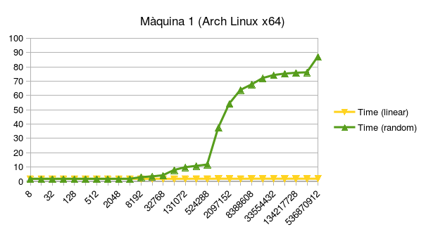
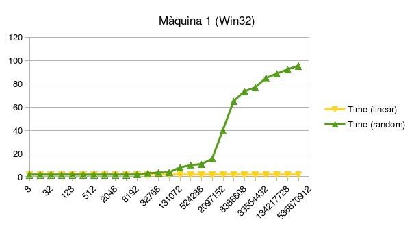
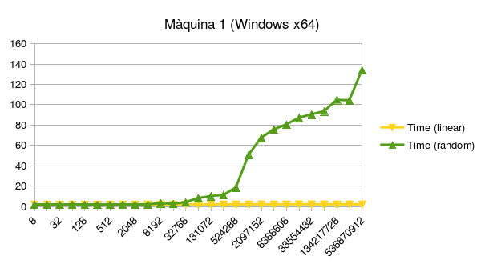
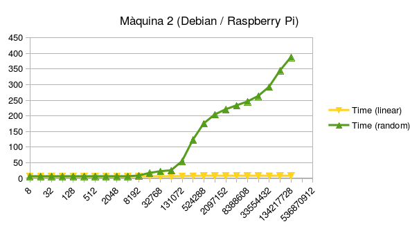
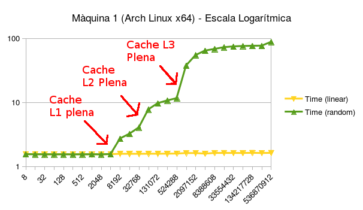

# Sistemes Operatius 1 - Problemes Addicionals

**Alumne:** Joan Bruguera Micó

## Enunciat del problema 3: Accés lineal o aleatori a un vector

En aquest problema s’analitzarà l’eficiència d’accés a un vector de mida N de forma lineal (de 0 fins a N-1) o de forma aleatòria. Per això es demana programar una aplicació que permeti comparar-ho. Per generar valors aleatoris podeu utilitza la funció `rand()`, per exemple (veure manual). Dissenyeu el vostre codi de forma que les “despeses secundàries” associades siguin negligibles. Tingueu en compte també que la funció `gettimeofday()` té resolució limitada en alguns sistemes (per exemple, de mil·lisegons). Per això es proposa, per exemple, recórrer el vector milers de vegades per generar valors mesurables. S’obtenen valors diferents en accedir de forma aleatòria que de forma lineal? Per què? Com us ho heu fet perquè la generació de valors aleatoris sigui una “despesa negligible”?

## Disseny de l'experiment

Per fer l'experiment, s'implementarà una funció `static bool test_speed(size_t num_iterations, size_t vector_size, bool randomize)`, on `num_iterations` és el nombre d'accessos a memòria (de forma lineal o aleatoria) que es realitzaràn, `vector_size` és la mida del vector de memòria sobre el que s'iterarà, i `randomize` serà `true` o `false` segons si els accessos són aleatoris o lineals respectivament. El vector que s'utilitzarà per fer la prova s'anomenarà `vector` i estarà format per elements de tipus `size_t` (generalment, en entorns moderns, té tants bits com un registre del processador, així que és adequat per fer una prova realista).

## Possibles problemes de mesura

Un dels principals problemes que es planteja és com fer la mesura de forma que sigui justa (els dos mètodes, el mètode lineal i el mètode aleatori realitzin exactament les mateixes instruccions de processador) i tingui la mínima recàrrega d'instruccions addicionals possible.

Per exemple, una forma (incorrecta) de fer la mesura seria la següent:

```c
[Codi font esborrat fins a l'entrega. Es mostra un codi amb dos bucles for diferents, sense generar els nombres aleatoris amb anterioritat]
```

Aquesta forma de fer les mesures té diversos problemes:

1. No es fa la mateixa feina en el cas de les iteracions lineals que les aleatòries. En el cas de les lineals, es fa una operació de mòdul, mentre que en el cas de les aleatòries, es fa una crida a `rand()`. Gairebé segur que aquestes operacions no tenen el mateix cost, així que els nostres temps mesurats no seran comparables.

2. És fàcil que el compilador detecti que no estem utilitzant el resultat, per exemple, dels accessos al vector, i per tant, elideixi el codi que hem escrit, sobretot a nivells d'optimització alts.

3. Hem d'intentar reduir la sobrecàrrega a causa del bucle `for`. Per cada accès al vector, també s'ha de comprovar la condició `i < num_iterations`, executar `i++`, i executar algunes operacions de salt a l'inici o final del bucle.

## Evitant el problema 1: Mateixa feina en ambdós casos

La forma que he utilitzat per reduir el problema explicat de la "injustícia" a l'hora de fer la prova és el següent: Abans d'iniciar la prova, dins de `vector`, es precomputarà en cada posició del vector l'índex del pròxim element a accedir.

És a dir, en el cas dels accessos lineals, `vector` contindrà `{ 1, 2, 3, ..., n, 0}`, mentre que en el cas aleatori, el vector contindrà una permutació cíclica aleatòria (l'algorisme per generar-la es bastant elemental i es pot trobar, per exemple, [en aquest enllaç](http://www.sciencedirect.com/science/article/pii/0020019086900736)).

Per exemple, en el cas aleatori, amb una mida de vector de 5, potser la permutació cíclica aleatòria que podem obtenir podria ser `{ 3, 0, 1, 4, 2 }`. Aleshores començarem accedint a l'element 0, del qual passarem a l'element 3, del qual passarem a l'element 4, del qual passarem a l'element 2, del qual passarem a l'element 1, i del qual finalment retornarem a l'element 0 i així successivament.

Amb aquesta idea, el cos de la prova queda:

```c
[Codi font esborrat fins a l'entrega. Es mostra un codi amb un bucle for, que recorre els índexs guardats dins el mateix vector].
```

D'aquesta manera, hem aconseguit, per una banda, reduir moltes de les despeses secundàries que estàvem tenint dins del bucle (fent, per exemple, la computació dels nombres aleatoris fora del bucle mesurat), i assegurar que la prova sigui justa, ja que ambdós casos executaran el mateix bucle, i per tant, les mateixes instruccions màquina.

## Evitant el problema 2: Aconseguir que el compilador no esborri el nostre codi

En el codi anterior, és fàcil que el compilador pugui adonar-se'n de que, desprès de la prova, `idx` no es fa servir, i per tant, decideixi esborrar tot el bucle de la prova sencer. Efectivament, en el mode d'optimització de velocitat (`-Ofast`), el compilador fa exactament això i aconsegueix que la prova s'executi instantàniament.

Per aconseguir que no l'esborri, hem de fer alguna cosa que forci el compilador a no esborrar la variable. Per exemple, fer un `printf` de `idx` desprès de la prova és suficient. En el meu cas, he afegit just després de la prova:

```c
[Codi font esborrat fins a l'entrega. Es mostra un codi amb una variable declarada com a volatile].
```

L'ús de `volatile` força al compilador a copiar `idx` a una nova posició de memòria, i per tant, a calcular `idx`, executant en cos de la prova anterior.

## Evitant el problema 3: Reduïnt la sobrecàrrega del bucle

Si generem el codi assemblador equivalent a la compilació amb `-Ofast` (mitjançant `-S`), obtenim el codi assemblador següent:

```c
movl	$33554432, %eax
xorl	%edx, %edx
.p2align 4,,10
.p2align 3
.L16:
subq	$1, %rax
movq	0(%rbp,%rdx,8), %rdx
jne	.L16
```

Podem observar que el cos del bucle (el codi que s'executa tantes vegades com iteracions tenim) té 3 instruccions: Una instrucció `subq` (manipulació del comptador del bucle), una instrucció `movq` (l'accès al nostre vector) i una instrucció `jne` (salt al principi del bucle).

Realment aquest muntatge ja és bastant bo, i ja podem obtenir bones mesures d'aquesta manera, però podem fer-ho millor:
Per tal d'intentar reduir la sobrecàrrega de les instruccions `subq` i `jne`, podem fer un unrolling del bucle, és a dir, repetir diverses vegades el cos del bucle. Si repetim l'interior del bucle 32 vegades com:

```c
[Codi font esborrat fins a l'entrega. Es mostra un codi amb el bucle for desenvolupat ('unrolled').]
```

Aleshores el cos del bucle en assemblador queda:

```c
movl	$33554432, %eax
xorl	%edx, %edx
.p2align 4,,10
.p2align 3
.L16:
movq	(%rbx,%rdx,8), %rdx
subq	$1, %rax
movq	(%rbx,%rdx,8), %rdx
movq	(%rbx,%rdx,8), %rdx
movq	(%rbx,%rdx,8), %rdx
movq	(%rbx,%rdx,8), %rdx
movq	(%rbx,%rdx,8), %rdx
movq	(%rbx,%rdx,8), %rdx
movq	(%rbx,%rdx,8), %rdx
movq	(%rbx,%rdx,8), %rdx
movq	(%rbx,%rdx,8), %rdx
movq	(%rbx,%rdx,8), %rdx
movq	(%rbx,%rdx,8), %rdx
movq	(%rbx,%rdx,8), %rdx
movq	(%rbx,%rdx,8), %rdx
movq	(%rbx,%rdx,8), %rdx
movq	(%rbx,%rdx,8), %rdx
movq	(%rbx,%rdx,8), %rdx
movq	(%rbx,%rdx,8), %rdx
movq	(%rbx,%rdx,8), %rdx
movq	(%rbx,%rdx,8), %rdx
movq	(%rbx,%rdx,8), %rdx
movq	(%rbx,%rdx,8), %rdx
movq	(%rbx,%rdx,8), %rdx
movq	(%rbx,%rdx,8), %rdx
movq	(%rbx,%rdx,8), %rdx
movq	(%rbx,%rdx,8), %rdx
movq	(%rbx,%rdx,8), %rdx
movq	(%rbx,%rdx,8), %rdx
movq	(%rbx,%rdx,8), %rdx
movq	(%rbx,%rdx,8), %rdx
movq	(%rbx,%rdx,8), %rdx
movq	(%rbx,%rdx,8), %rdx
jne	.L16
```

Així ara tenim 32 instruccions `movq` per cada bloc d'instruccions `jne` i `subq`, aconseguint així reduir la influència d'aquestes dues instruccions sobre el temps mesurat.

## Mètode de mesura del temps

Per mesurar el temps, a Linux he fet servir la funció `gettimeofday()` i a Windows la funció `QueryPerformanceCounter()`. He fet servir aquesta funció ja que és la que es plantejava a l'enunciat i no crec que tingui cap problema major a l'hora de fer-la servir pel meu cas d'ús.

Per fer la implementació de les proves de temps, m'he basat en [aquest codi de StackOverflow](http://stackoverflow.com/a/2349941).

Com a desavantatges d'aquestes funcions, es poden citar que pot fallar a l'hora de realitzar mesures si canvia l'hora del sistema (no ens afecta ja que fem la prova en un entorn controlat) i que la seva precisió és limitada (pels ordres de magnitud que treballem, no és rellevant).

# Mesures realitzades i resultats

## Mesures realitzades

Per fer l'experiment, he decidit mesurar l'efecte de realitzar 2^30 (=1073741824) accessos sobre un vector de diverses mides, amb mides 2^3 (=8), 2^4 (=16), 2^5 (=32), ..., 2^29 (=536870912) elements, mitjançant accessos lineals o aleatoris en cadascun dels casos.

## Compilació

A Linux s'ha compilat amb el compilador GCC, mitjançant l'switch "-Ofast" per aconseguir que ens optimitzi el màxim el codi, per reduir despeses innecessàries, i l'switch "-std=gnu99" ja que el codi està escrit en C99 + extensions de POSIX/GCC (`gettimeofday` + clàusula en assemblador per delimitar l'inici del bucle i poder-lo trobar més fàcilment al fitxer .s).

A Windows s'ha compilat amb el compilador de Visual Studio 2015 amb les opcions per defecte.

En tots els casos, he verificat que el codi del bucle d'accessos generat en assemblador ben optimitzat de forma que gairebé tot el temps de la prova consisteixi en els accessos al vector.

## Anàlisi dels resultats

Per poder imprimir els resultats he fet que el programa en C imprimeixi un fitxer CSV amb els resultats. Aquests resultats posteriorment els importo a LibreOffice Calc i faig servir aquesta eina per extreure gràfics.

## Sistemes de prova
He utilitzat dos sistemes diferents per executar la prova:

### Sistema 1

Es tracta d'una sistema de sobretaula estàndard. Sobre aquesta màquina es faran proves sobre Linux (Arch Linux instal·lada i actualitzada, entorn d'escriptori XFCE) i Windows 7 (tant compilant el programa per 32 o 64 bits).

El processador del que disposa és (`cat /proc/cpuinfo`):

```
4x

vendor_id	: GenuineIntel
cpu family	: 6
model		: 58
model name	: Intel(R) Core(TM) i5-3470 CPU @ 3.20GHz
stepping	: 9
microcode	: 0x17
cpu MHz		: 3426.500
cache size	: 6144 KB

```

La memòria de la que disposa és (`cat /proc/meminfo`):

```
MemTotal:        8125108 kB
```

Sortida de `uname -a` a Linux:

```
Linux PC 4.5.4-1-ARCH #1 SMP PREEMPT Wed May 11 22:21:28 CEST 2016 x86_64 GNU/Linux
```

Sortida de `gcc --version` a Linux:

```
gcc (GCC) 6.1.1 20160501
```

A Windows s'utilitzarà Visual Studio 2015 per compilar.

### Sistema 2

És un sistema Raspberry Pi 2 Model B amb la distribució "Raspbian" (Debian Jessie stable) instal·lada i actualitzada. El sistema estava en estat de repòs i sense executar un entorn gràfic.

El processador del que disposa és (`cat /proc/cpuinfo`):

```
4x

model name	: ARMv7 Processor rev 5 (v7l)
BogoMIPS	: 57.60
Features	: half thumb fastmult vfp edsp neon vfpv3 tls vfpv4 idiva idivt vfpd32 lpae evtstrm
CPU implementer	: 0x41
CPU architecture: 7
CPU variant	: 0x0
CPU part	: 0xc07
CPU revision	: 5

```

La memòria de la que disposa és (`cat /proc/meminfo`):

```
MemTotal:         947764 kB
```

Sortida de `uname -a`:

```
Linux raspberrypi 4.4.9-v7+ #884 SMP Fri May 6 17:28:59 BST 2016 armv7l GNU/Linux
```

Sortida de `gcc --version`:

```
gcc (Raspbian 4.9.2-10) 4.9.2
```

## Resultats obtinguts i comentari

S'executen les proves sobre les màquines. En el cas de les proves amb Windows en mode 32 bits (màquina 1), la última de les proves va fallar, mentre que en el cas de la Raspberry Pi (màquina 2), les dues últimes proves van fallar, per falles en la reserva de memòria ambdues vegades.

Les gràfiques dels resultats obtinguts són les següents:









Es pot observar que en el cas dels accessos lineals, el temps gairebé no depèn de la mida del vector. Si que s'observa un petit increment, segurament a causa de petits moviments a la caché, però en general aquests no són molt notables.

En canvi, en el cas dels accessos aleatoris, s'observa que, mentre que per vectors petits, el temps és gairebé idèntic al temps que pels accessos lineals, a mesura que es fa gran el vector, el temps augmenta ràpidament, pràcticament arribant a ser 100 vegades més gran que el mateix nombre d'accessos de forma lineal.

L'explicació per aquests canvis és l'ús de les cachés del processador. En el cas lineal, l'accés a les posicions de memòria del vector és seqüencial, fent molt probable que la pròxima posició del vector a la que accedim ja es trobi a les cachés més ràpides del processador i per tant es completi ràpidament. En canvi, en el cas aleatori, és molt probable que la pròxima posició del vector a la que accedim no es trobi a les cachés més ràpides del processador ja que els accessos són impredictibles, així que s'haurà de dependre de cachés més lentes o accessos a la RAM, les quals resulten més lentes i són la causa dels increments de temps.

Qualitativament, es pot observar que en els accessos aleatoris, a l'inici tarden gairebé el mateix temps que els accessos lineals, ja que el vector sencer encara cap a les cachés més ràpides, però a mesura que es fa gran, el vector deixa de cabre a les cachés més ràpides, depenent aleshores de l'accés a cachés més lentes o fins i tot d'accessos a la RAM, més lents.

Per verificar la teoria dels accessos a la caché, vaig buscar les especificacions de les cachés del processador utilitzat en la màquina 1, les quals vaig trobar a [la següent URL](http://www.cpu-world.com/CPUs/Core_i5/Intel-Core%20i5-3470.html):

* Per cada core, una caché de 32KB (=4196 elements de 8 bytes) de primer nivell.

* Per cada core, una caché de 256KB (=32768 elements de 8 bytes) de segon nivell.

* Compartida per tots els cores, una caché de 6MB (= 786432 elements de 8 bytes) de tercer nivell.

En la següent gràfica de la màquina 1 (en escala logarítmica per tal de remarcar els canvis relativament més grans), estan marcats els canvis més sobtats de temps, els quals coincideixen amb l'emplenament dels diferents nivells de caché de la màquina 1:



Un fenomen que no he estat capaç d'explicar és que, en la màquina 1, quan arribem als 2^29 (=536870912 elements) en el cas de 64 bits, els quals ocupen ja 4GB de memòria, hi ha un altre increment sobtat de temps, tot i que tampoc és tant pronunciat com els altres. Aquest fenomen és consistentment reproduïble i es produeix tant a Windows com a Linux. Crec que és possible que sigui a causa de la fragmentació de memòria (no és possible que sigui a causa de l'ús de memòria virtual / *swap* ja que a Linux la tinc desactivada).

Amb això concloc l'anàlisi d'aquest problema.
